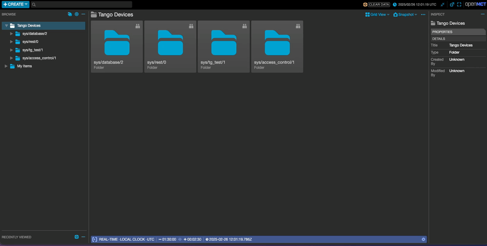
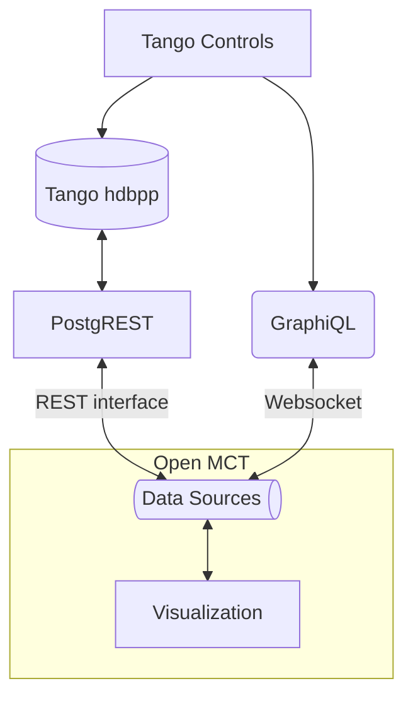

# Tango Controls and Open MCT

This project is a proof of concept that shows how Open MCT can be used to view live and archived Tango attributes using its feature rich, extensible data visualization framework

<!-- START doctoc generated TOC please keep comment here to allow auto update -->
<!-- DON'T EDIT THIS SECTION, INSTEAD RE-RUN doctoc TO UPDATE -->

- [Recordings](#recordings)
  - [Live data](#live-data)
  - [Archived data from hdbpp](#archived-data-from-hdbpp)
- [Caveat](#caveat)
- [Design](#design)
  - [The design is split into two parts](#the-design-is-split-into-two-parts)
    - [Archived data](#archived-data)
    - [Live attributes](#live-attributes)
- [Development](#development)
  - [Setup to view live attributes](#setup-to-view-live-attributes)
    - [GraphiQL](#graphiql)
    - [Subscribe to a Tango attribute](#subscribe-to-a-tango-attribute)
  - [Setup to view archived attributes](#setup-to-view-archived-attributes)
  - [Setup to view archived and live attributes](#setup-to-view-archived-and-live-attributes)
  - [Ports](#ports)
- [Open MCT setup](#open-mct-setup)
  - [Install the plugins](#install-the-plugins)
    - [Update index.html](#update-indexhtml)
    - [Update src/plugins/plugins.js](#update-srcpluginspluginsjs)
  - [Run the server](#run-the-server)

<!-- END doctoc generated TOC please keep comment here to allow auto update -->

# Recordings

## Live data


## Archived data from hdbpp



# Caveat

- Enums and numeric scalars can be graphed
- Arrays are converted to string and displayed in the data table
- Images are _not_ supported

# Design



## The design is split into two parts

### Archived data

PostgREST is used to provide a REST interface into the Tango hdbpp. This interface is then registered as an Open MCT data provider. This data provider can then be queried by time and displayed.

### Live attributes

GraphiQL subscriptions are used to subscribe to attributes and registered as an Open MCT data provider.

# Development

## Setup to view live attributes

```sh
cd docker-compose
docker network create tango
docker compose -f tango-db.yml  -f  tango-test.yml -f tangogql.yml  up
```

### GraphiQL

The Graphql endpoint should be available at:
_[http://localhost:5004/db](http://localhost:5004/db)_.

```gql
# Query a device
query {
  devices(pattern: "sys/tg_test/1") {
    attributes(pattern: "*") {
      name
    }
    name
    state
    connected
    alias
    deviceClass
    pid
    startedDate
    stoppedDate
    exported
  }
}

# .. Or explore the schema and types
query {
  schema: __schema {
    types {
      name
    }
  }

  subscriptionFields: __type(name: "Subscription") {
    fields {
      name
    }
  }

  queryFields: __type(name: "Query") {
    fields {
      name
    }
  }
}
```

### Subscribe to a Tango attribute

For example, to consume the GraphQL API open a website and in the console:

```js
const socket = new WebSocket('ws://127.0.0.1:5004/socket', "graphql-ws")

socket.onmessage = function (event) {
  const parsed_data = JSON.parse(event.data)
  const point = {
    value: parsed_data.payload.data.attributes.value,
    timestamp: parsed_data.payload.data.attributes.timestamp * 1000,
    id: 'sys.tg_test.1.double_scalar',
  }
  console.log(point)
}

const gqlSubscriptionQuery =
  '{ "type": "start", "payload": { "query": "subscription Attributes($fullNames: [String]!) {  attributes(fullNames: $fullNames) {    device    attribute    value    writeValue    timestamp  }}", "variables": { "fullNames": ["sys/tg_test/1/double_scalar"] } } }'

socket.onopen = () => socket.send(gqlSubscriptionQuery)

// You should see logs something like
{ "value": 232.01497690132726, "timestamp": 1715785846038.907, "id": "sys.tg_test.1.double_scalar" }
```

## Setup to view archived attributes

These steps will start up the Database, set it up and load random data over the last month for:
- `sys/tg_test/1`
  - `att_scalar_devshort`
  - `att_scalar_devdouble`
  - `att_scalar_devfloat`


```sh
cd docker-compose
docker network create tango
docker compose -f hdbpp.yml  -f postgrest.yml -f swagger.yml  up
```

## Setup to view archived and live attributes

```sh
cd docker-compose
docker network create tango
docker compose -f tango-db.yml -f tango-test.yml -f tangogql.yml -f hdbpp.yml -f postgrest.yml -f swagger.yml up
```

## Ports

Depending on the deployment the following ports will be opened:

- Database (Postgres)
  - 5432
- PostgREST (REST interface into the database)
  - 3000
- Swagger
  - 8081
- TANGO_HOST
  - 10000
- TangoGQL
  - 5004

# Open MCT setup

Follow the instructions from _[https://github.com/nasa/openmct](https://github.com/nasa/openmct)_.

## Install the plugins

### Update index.html

Add the following lines

```diff
...
+openmct.install(openmct.plugins.TangoTree());
+openmct.install(openmct.plugins.TangoData());
document.addEventListener('DOMContentLoaded', function () {
  openmct.start();
});
...
```

### Update src/plugins/plugins.js

```diff
...
import WebPagePlugin from './webPage/plugin.js';
+import TangoTreePlugin from '../../../tango_plugin/TangoTreePlugin.js';
+import TangoDataPlugin from '../../../tango_plugin/TangoDataPlugin.js';

const plugins = {};
...
+plugins.TangoTree = TangoTreePlugin;
+plugins.TangoData = TangoDataPlugin

export default plugins;
```

## Run the server

```console
npm start
```

Browse to _[http://localhost:8080/](http://localhost:8080/)_
